# LLM from Scratch
- A decoder-only LLM
## Arch Steps

## Preparing Dataset
### Tokenizations
- Splitting words to tokens
- Involves creating text sampling
- Covert token into vectors - called Embeddings
- Can embed different formats - text,video,audio
- Embedding are done by embed models for each specific data type

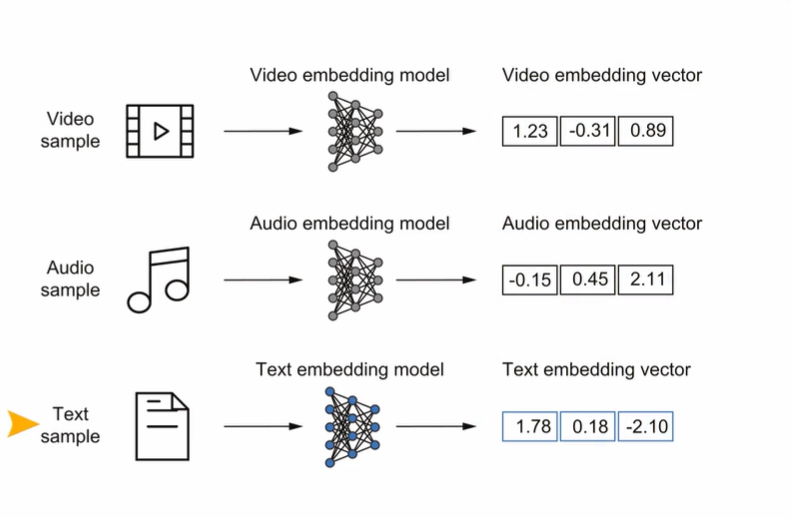

### Embedding defined
- Is a mapping from discrete objects e.g words, images, documents etc to a POINTS in a continous vector space. 
- This is key in converting non-numerical data into a format that neural networks can understand.
- Embeddings can be words, sentences etc

In this project we will focus on word embedings using Word2Vec

### 2D Word2Vec
- Word2Vec is a pre-trained model for word embeddings generations
- Word embeddings can have 1 to 1000s of dimensions.
- GPT-2 models with 117million and 125million params uses an embedding size of 768 dimensions
- Largest GPT-3 model with 175b params uses a embedding of 12,288 dimensions
- Higher dimensionality captures nuanced relationships but at high cost of computation

### Note
*LLMs* produce their own embeddings that r part of input and are updated during training - this ensures embeddings are updated to specific task and data at hand.

#### Sample scatter plot for a 2D word embendings

### Tokenization
- We will use [The verdict] story text - this is on wiki.
#### Decoder-only LLM tokenizations steps

#### Creating token IDs
- token ID is an integer number assigned to each unique token. Forming a vocabulary matrix

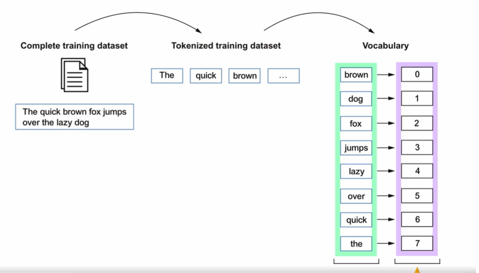

#### Tokenizer.py 
- Below is the implementation and how it is used:
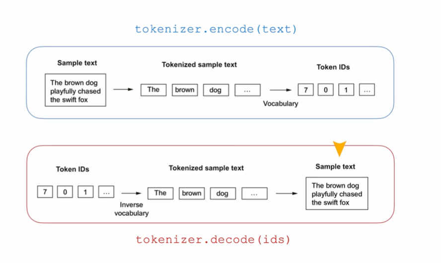

#### handling unrelated text sources with special context tokens
- unk - unknown words - "<|unk|>"
- endoftext - "<|endoftext|>"
- BOS - beginning of sequence - mark start of text
- EOS - end of sequence - similar to endoftext
- PAD - padding - extending texts to match/unify lengths in training data
- 

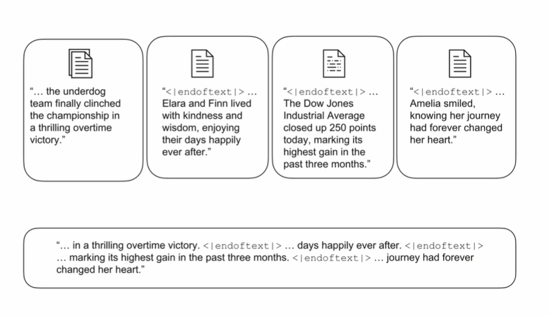

New tokenizer version 2 illustrates use of special context token unk

GPT models do not use unk but rather byte pair encoding BPE

#### BPE
Byte pair encoding - the tokenizer used in training GPT 3
We will use tiktoken library
- BPE handles out of context words such as someunkownPlace by splitting them into subwords or even chars.

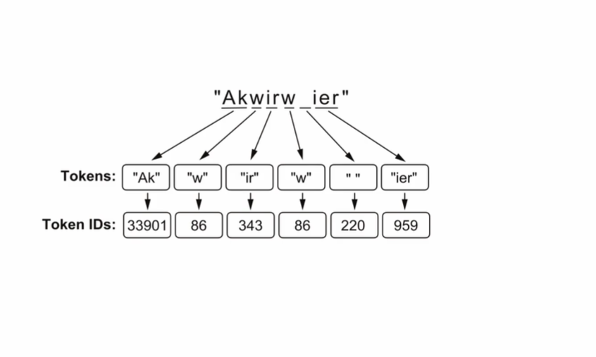

### Data sampling - sliding window
- prediction process
- using tiktoken BPE encoder
- using pytorch data loader
#### Visuals
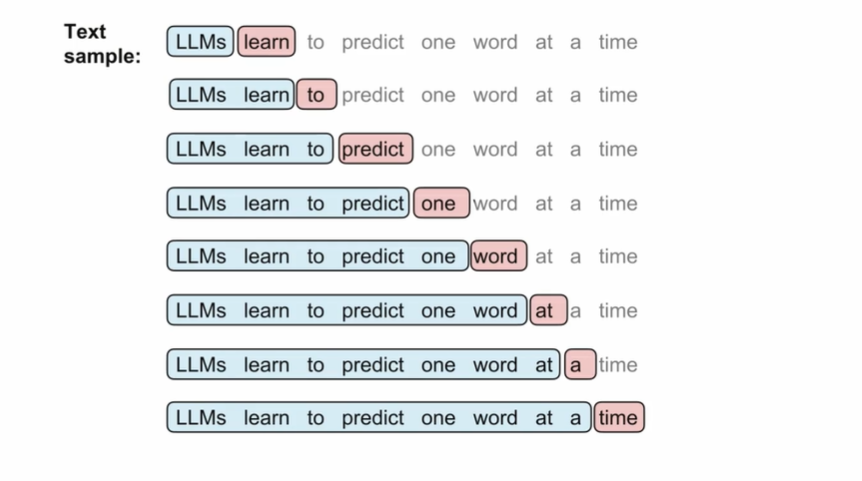

#### Data loading - pytorch
- Pytorch tensors - multidimensional arrays of LLM inputs(text that LLM sees) & targets(what LLM should predict)

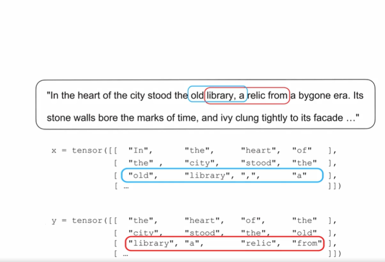

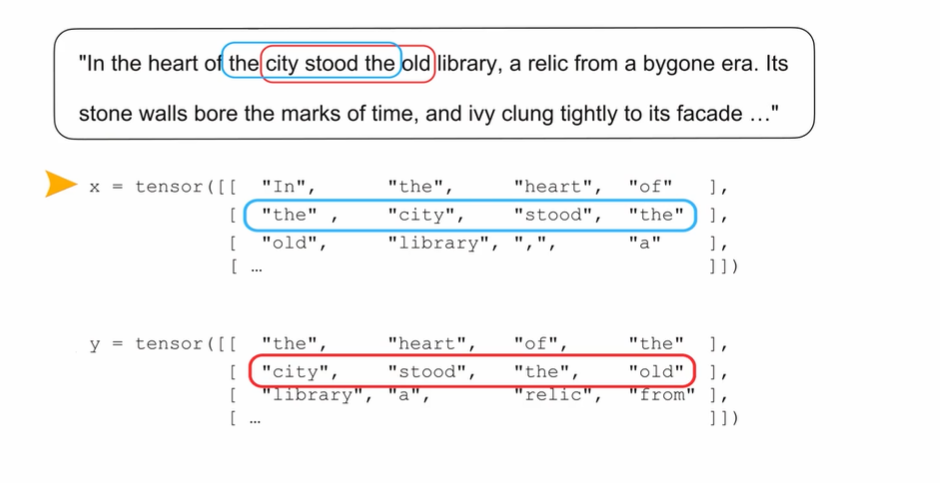

#### Key variables in pytorch sensors-based data loading
- max size = the number of inputs in each tensor - LLM trains on input size = 256
- stride = the number of positions the input shift across the batches (sliding window), 
if stride = max_size/input-size then there will be no intersection between batches
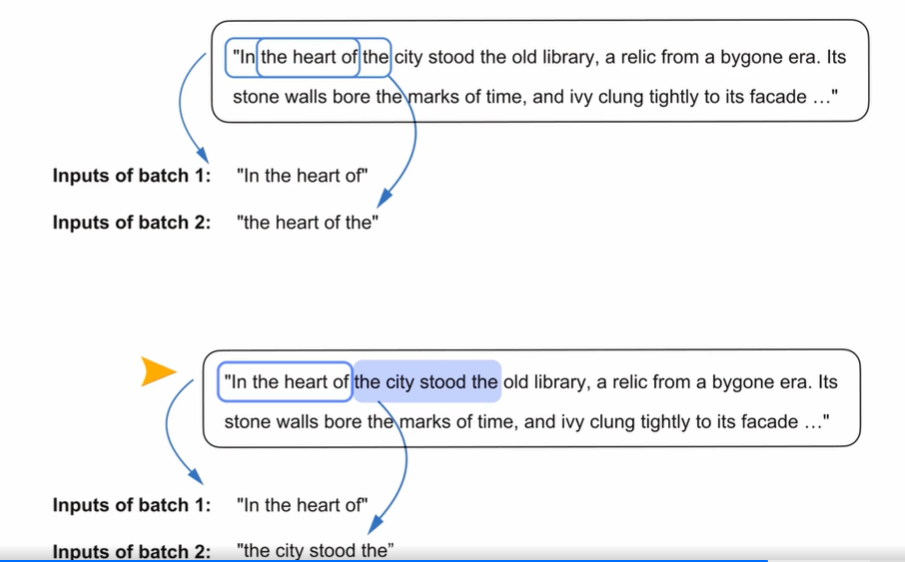

- Batch Size - the number of pairs of tensors to load. batch size of 1 requires less momory but noisy model updates
it is there4 useful for illustrations but not actual training. We can use batch size > 1 and below is the output:

# Data preparation steps - summary
- Input text
- Tokenize the text
- Convert text to token IDs using a vocabulary
- Create token embeddings/vectors + Add positional embeddings
- The result is input embeddings - LLM ready input
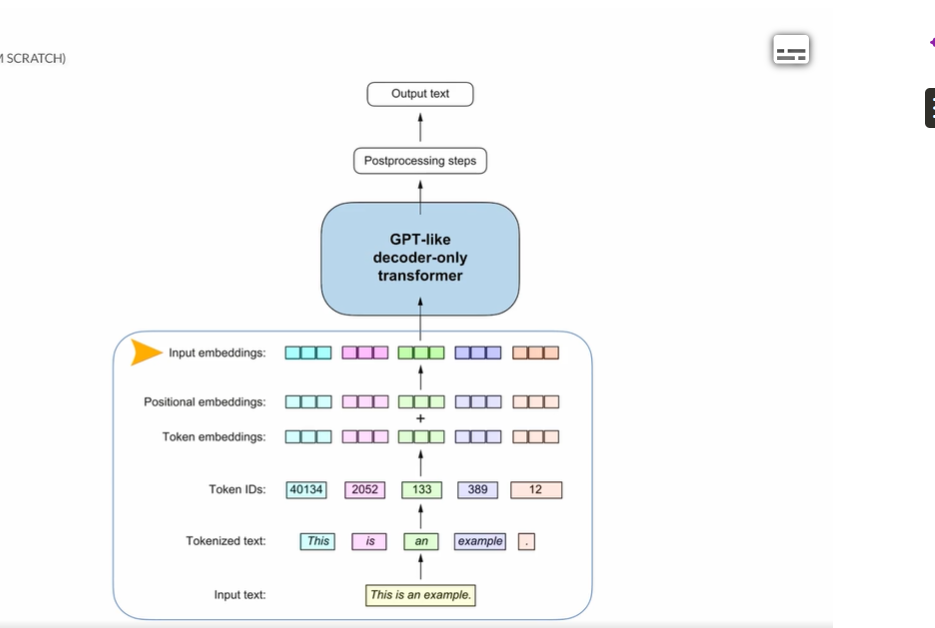

This is then passed on to GPT-like decoder-only transformers. The postprocessing is done to get output text.

# Coding attention mechanisms
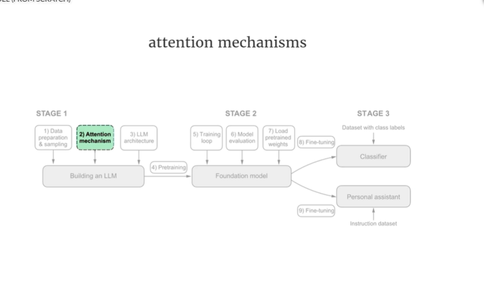
## Steps involved
- Simplified self-attention - introduces broader idea
- Self-attention - compute trainable weights - assesses relationships and dependencies in the input text.
- Causal attention - temporal order during text-generation 
- Multi-headed attention - Simultaneous processing
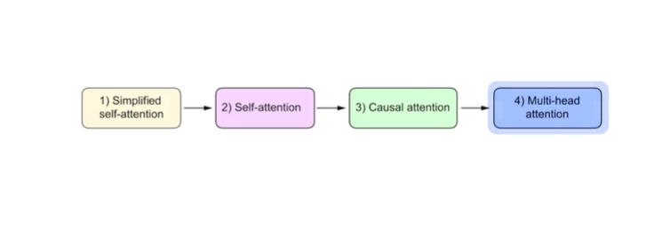

## Self attention
### Computing context vectors
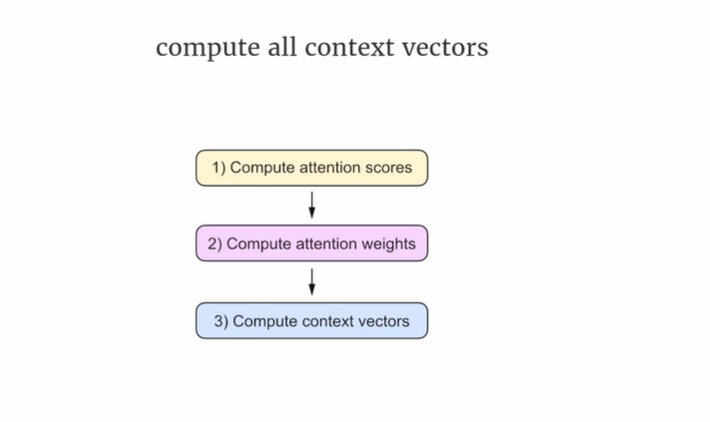

